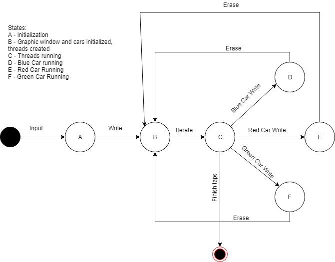
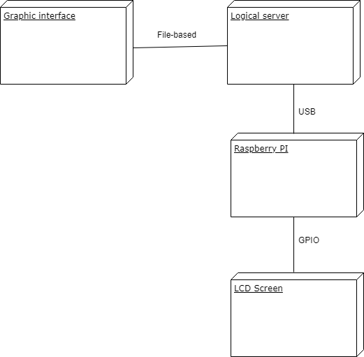

Multithreaded Grand Prix Simulator - Architecture document
----------------------------------

- Team members:
	- Lourdes Alicia García Peña, A01551772
	- Jorge Dominic Márquez Muñoz, A00569034
	- José Gerardo Galindo Valadez, A00790359
- Subject: Advanced Programming.
- Professor: Obed Nehemías Muñoz
- Date: 14/05/2019

Introduction
----------------------
In this document we are going to present the general architecture of the grand prix project, as well as a description of the approach of solution to the problem and some deep discussion about the components that work together on the general solution. We consider important to extend a simple explanation for the reader's own interest and understanding of the development of this project. Finally, we deliver team conclusions about our experience in this work and the techniques used.

General description and solution
--------------------
For this project, a simulation of a grand prix was done. This simulation requested that a multithreaded implementation was made, each of the threads would represent a car, and we could specify number of cars and speed. This way, a race was simulated, and each car would run in their own thread separate from the others. Additional to this, we tried to implement some hardware to display the winners. In a big scheme, this is the general objective of the project. For those general requirements, we implemented a general logic that will be described below. 

First of all, a general race manager is developed in C. This program is the one that recieves the number of cars, laps, speed and manages the cars' threads. The graphic interface is made in a Python script using a tool called pygame. This pygame can load and move our car images through the use of coordinates in a 2D environment.To communicate these two, we simply use files: an initiation file to indicate the python script how many cars to initialize, and a status file that contains the coordinate to which the car will move. This file is our critical section, since we must be careful on which thread writes the file, since only one at a time can do it.

The coordinates in which the cars move are defined in a header file that containes three arrays of coordinates that define the path each car follows in its run. Each thread iterates through its corresponding array. This way, we can handle each car a single thread that runs in its own, just like a racing car does in real life. Finally, the results are shown in a LCD screen, that gets the data through a Raspberry PI. All these makes the general description of the approach that run behind the graphic window and the LCD screen.

Components
------------
- Car: the main component of the project. It is represented by a thread and makes the inner calculations to help depict the figure of the car in the graphical interface an its path. A maximum of three is set.
- Graphic interface: the representation of the racing course. It is represented by an image through a Python tool. This component also includes the instances for the cars.
- Thread manager: the code in C that manages all threads. It includes its corresponding functions to run each thread, lock variables and write in our files.
- Init file: the initial setup file on which the graphical interface is built. It includes the number of cars and number of laps.
- Status file: the file that includes the current status of the car and is written by each thread. It includes: the car name, its x and y coordinates, a value that sets if it should turn around or not, and a value that sets if it is running or not.
- Coordinates.h: the defined coordinates of the path of each car, put into three different arrays that each thread iterates depending on the car it represents.
- Raspberry PI: the first hardware part. A microcontroller that is the mean of connection between the code logic and the LCD screen.
- LCD screen: the other hardware part. An LCD screen that dosplays the results of the race.

Technologies
-------------
- C: the C language was used for the cars' implementation using p_threads, a built interface to be able to manage threads for our current program. 
- Python: pygame library is used in a Python environment to generate and represent the race in a visual way. It loads the course and the cars selected by the user, and recieves all data from the C operations to move the cars.
- Raspberry PI: microcontroller ran on an UNIX operative system. It is capable of running diverse languages' scripts, and holds a right place as an interface between hardware components and programming languages.
- LCD screen: liqud crystal display, in which the final results are set through the Raspberry PI.

Architecture
-------------------------------
This part shows the interaction between components in four UML diagrams. These diagrams show a different view. Below, there will be a short description of each view, the diagram that was made, and the diagram itself:

- Logical view: it concerns the different logical phases a program can have, and will use a state diagram to represent it.

- Development view: it concerns the different activities that take place in the system, and will use an activity diagram to represent it.

- Process view: it concerns the general interaction of parts of a system, and will use the component diagram to represent it.

- Physical view: it concerns the hardware parts of our system, and will use a deplyment diagram to represent it.

Conclusions
------------------
Working with threads has been quite a nice challenge. As we progressed in the course, we could see that these kind of abstractions were periodically easier to make in our heads. Trying to find out the critical part, synchronization, variable locks and still giving it a well-made design and architecture are practices that make a good programmer. 

For this project, we successfully designed a solution for the grand prix simulation, in which the basic class material was undoubtedly used, such as the basic C handling and, as we said before, the appropriate abstraction level. This also gives us a close look on how important and necessary threads are. 
